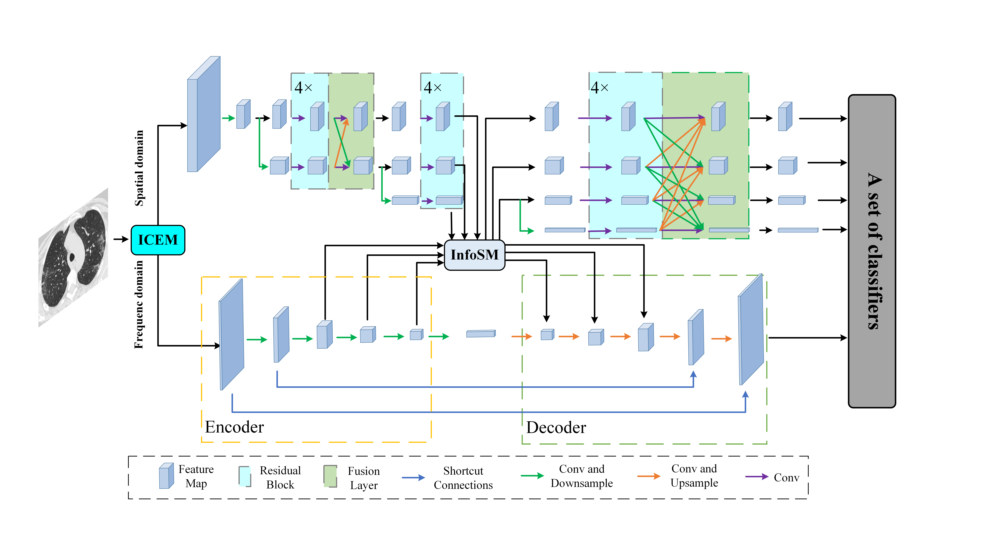

# HR-UVnet : A spatial domain and frequency domain dual-branch network for COVID-19 diagnosis
<div align=center></div>
## Installation
Clone the repo:

```bash
git clone https://github.com/flashxin/HR-UVnet.git
```
## Dataset download link
+ SARS-Cov-2 CT Scan:https://www.kaggle.com/datasets/plameneduardo/sarscov2-ctscan-dataset
+ COVID-CTset:https://www.kaggle.com/datasets/mohammadrahimzadeh/covidctset-a-large-covid19-ct-scans-dataset
+ Chest X-ray:https://www.kaggle.com/datasets/jtiptj/chest-xray-pneumoniacovid19tuberculosis/code
## Data Preprocess
File directory organization
```bash
└── Train
          ├── 0
            ├──XXX1.png
            ├──XXX2.png
                    :
            └──XXXn.png
          ├── 1
                    :
          └── n
└── Val
          ├── 0
          ├── 1
                    :
          └── n
```
## Custom datasets
If you want to use your own dataset or generalize our methodology, you need to complete two steps.
+ Adjust the file directory to meet the code requirements
+ Modify the path to the dataset in /net/LoadDataset.py
## Citation
- If you found our work useful in your research, please consider citing our work at:
```
    #No published paper, will be updated later
```

